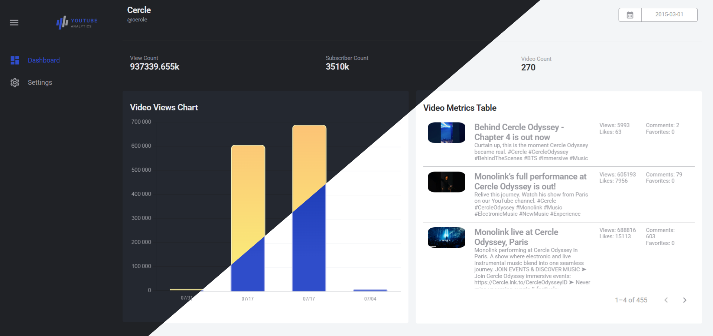
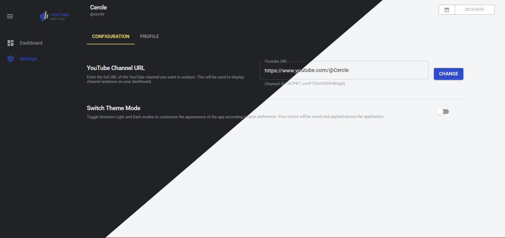
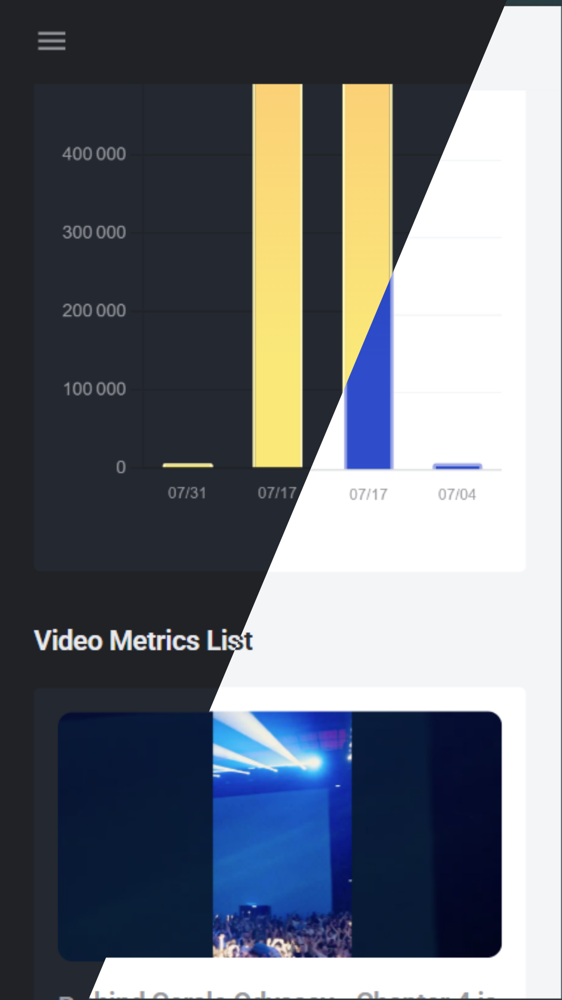
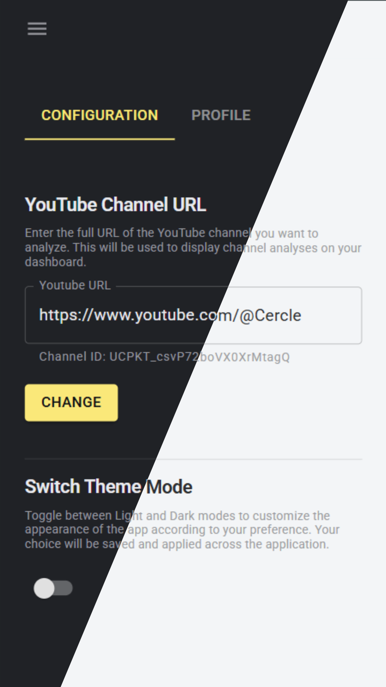
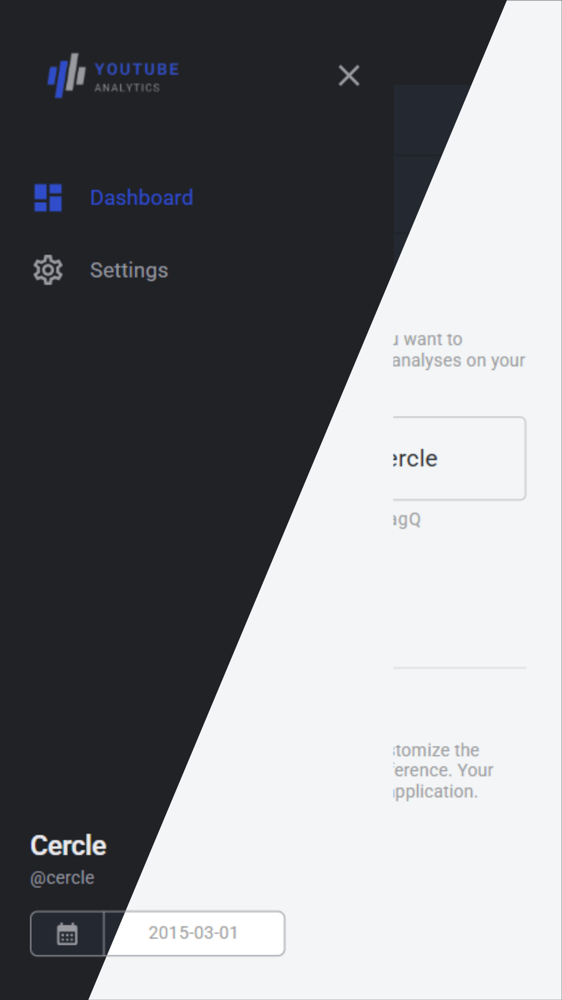

# YouTube Analytics Dashboard

A modern, real-time analytics dashboard for YouTube content creators to track channel performance, analyze video metrics, and visualize growth trends.

# 🌍 Website Link

[Click here to try the app](https://ytbanalytics.netlify.app/)

## Screenshots

### Desktop
<div >


</div>

### Mobile
<div>



</div>

# Features

- **YouTube Channel URL Input** - Simply paste any YouTube channel URL to analyze
- **Channel Overview Metrics** - Display total views, subscribers, videos count, and channel creation date
- **Video Data Table** - Interactive table showing all channel videos with sortable and filterable data
- **Video Performance Chart** - Visual chart displaying video titles (X-axis) vs their view counts (Y-axis)
- **Responsive Design** - Fully responsive interface built with Material-UI

# Technical Implementation

## Architecture & Code Quality

- **Responsive Design** - Fully responsive interface built with Material-UI components and grid system
- **State Management** - Redux Toolkit for efficient, predictable state management with normalized data structure
- **Type Safety** - Complete TypeScript implementation with strict typing for better code quality and developer experience
- **Modern Routing** - React Router v7 with data loading patterns and route-based code splitting
- **Server-Side Pagination** - Efficient data handling with MUI X Data Grid server pagination for large video datasets
- **Component Architecture** - Modular, reusable components following React best practices
- **Error Handling** - Comprehensive error boundaries and API error handling
- **Performance Optimization** - Memoization, lazy loading, and optimized re-renders

## Tech Stack

- **React 19** – Latest React with concurrent features
- **TypeScript** – Type-safe development
- **Material-UI v6** – Modern component library
- **Redux Toolkit** – Predictable state management
- **React Router v7** – Data-driven routing
- **Chart.js** – Beautiful, responsive charts
- **Axios** – HTTP client for API requests
- **YouTube Data API v3** – Fetching and visualizing YouTube channel & video data

## Installation & Setup

### Prerequisites

- Node.js 18+
- pnpm (recommended) or npm/yarn
- YouTube Data API v3 key

### 1. Clone the repository

```bash

git clone https://github.com/yourusername/youtube-analytics-pro.git
cd youtube-analytics-pro

```

### 2. Install dependencies

```bash

pnpm install

```

### 3. Environment Configuration

Create a `.env` file in the root directory:

```env

VITE_YOUTUBE_API_KEY=your_youtube_data_api_v3_key
VITE_API_BASE_URL=https://www.googleapis.com/youtube/v3

```

### 4. Start development server

```bash

pnpm run dev

```

## Contributing

1. Fork the repository
2. Create a feature branch (`git checkout -b feature/amazing-feature`)
3. Commit changes (`git commit -m 'Add amazing feature'`)
4. Push to branch (`git push origin feature/amazing-feature`)
5. Open a Pull Request

## API Usage

This application uses the YouTube Data API v3. You'll need to:

1. Create a project in Google Cloud Console
2. Enable YouTube Data API v3
3. Generate an API key
4. Add the key to your environment variables

# About the Developer

Built by Mohamed Gara as a demonstration of modern React development skills. This project showcases the ability to create production-ready applications with complex data visualization and state management.

## Connect with me:

- LinkedIn: [linkedin.com/in/gara-mohamed-62516419a](https://www.linkedin.com/in/gara-mohamed-62516419a/)
- GitHub: [github.com/garamohamed98](https://github.com/garamohamed98)
